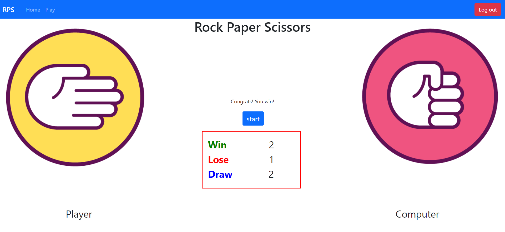

# RPS_OpenCV
The classic Rock-Paper-Scissors game on local server with a turn-on webcam.

The purpose of this project is to practice **Web Development (HTML, CSS, JavaScript, Bootstrap, Flask)** and **Computer Vision (OpenCV)** in **Python**.

## Installation
Install relevant packages:
`pip install -r requirements.txt`

## Run the program
Run the command:
`python app.py`